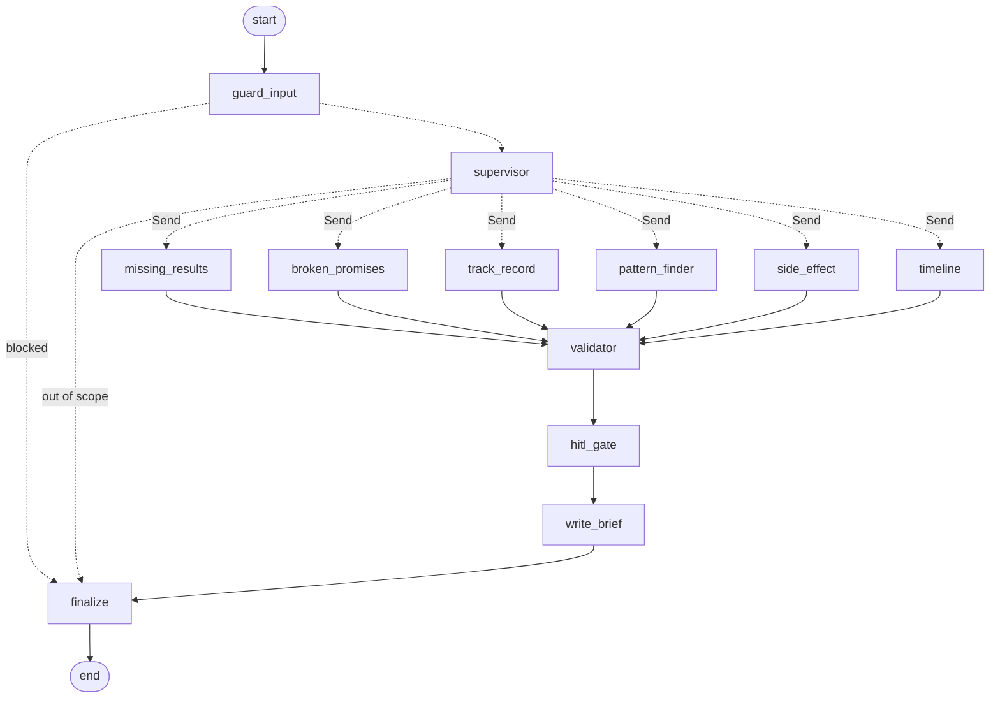

# Astra

**Six AI agents audit how honestly clinical trials report their results, and a human reviewer has the final say.**

Astra reads public ClinicalTrials.gov records and PubMed abstracts and looks for missing results, switched outcomes, unreliable sponsors, cross-study outliers, unreported side effects and silently delayed trials. Every finding is checked against the data, low-confidence ones wait for a human, and every rejection teaches the agent a new rule.

- **Live API:** [astra-production-a9f3.up.railway.app/docs](https://astra-production-a9f3.up.railway.app/docs) (interactive OpenAPI docs; the web app follows)
- **Screenshot of the Live Run page:** *added once the frontend is built*

> Signals are leads for human review, not accusations of misconduct.

---

## What it does

A supervisor reads the task and sends it to the specialists it needs. They run in parallel.

| Specialist | What it detects | Signal type |
|---|---|---|
| Missing Results | Completed trials that never posted legally required results | `missing_results` |
| Broken Promises | The registered primary outcome differs from what papers report (outcome switching) | `broken_promise` |
| Track Record | Sponsors with a poor record of posting results | `low_credibility` |
| Pattern Finder | Sponsors whose missing-results rate is far above their peers | `cross_study` |
| Side Effect Checker | Serious adverse events in the registry that linked papers leave out | `safety_gap` |
| Timeline Analyst | Trials silently past their own schedule (still "active", or not updated for years) | `timeline_delay` |

The data: 788 FDA-regulated interventional trials across oncology, cardiovascular, CNS/mental health and type 2 diabetes, their 756 linked PubMed papers, and 490 sponsor profiles.

## Architecture



```
ClinicalTrials.gov + PubMed ─▶ ingestion CLI ─┬─▶ Neon Postgres (+ pgvector)
                                              ├─▶ Google Cloud Storage (raw + processed JSON)
                                              └─▶ Layer-Engine (RAG service, over MCP)

Web app ──HTTP/SSE──▶ FastAPI on Railway ──▶ LangGraph graph ──▶ OpenRouter (DeepSeek V4 Flash)
                                                             ├─▶ Layer-Engine: search + citation checks
                                                             └─▶ LangSmith traces
```

## How it works

**Tools compute facts, the LLM judges.** Deterministic Python and SQL work out every fact: months overdue under FDAAA 801, days past an estimated date, outcome similarity scores, serious adverse event counts, sponsor compliance rates. The model reads those facts, decides what is worth flagging, sets a confidence and explains why. It never does the arithmetic.

**Routing.** The supervisor is one structured model call that returns the agents to run, a condition group and a reason. Off-topic tasks and prompt-injection attempts are refused. LangGraph's `Send` fans out to the chosen specialists in parallel, and a validator node runs exactly once after they all finish (a test proves this).

**Agents.** All six specialists share one hand-built ReAct subgraph: the model calls SQL-backed tools for up to six steps, then fills a strict findings schema in which every claim must cite an NCT ID or PMID. Specialists differ only in their prompt, tools and confidence threshold. No prebuilt agent constructors are used.

**Memory and learning.**
- *Episodic memory* stores a summary of each agent's past runs in LangGraph's Postgres store and retrieves similar ones by meaning.
- *Procedural memory* holds each agent's rules. When a reviewer rejects a finding, LangMem turns the rejection into one general rule, linked back to the rejected signal, that appears in the agent's next prompt.
- *Semantic memory* holds the sponsor profiles, computed by SQL.

**Human in the loop.** Findings at or above the agent's threshold are auto-approved; the rest wait in a review queue. A reviewer approves, edits or rejects them later. It is an asynchronous queue rather than `interrupt()`, because a batch analysis should not freeze while waiting for a person.

**Six guardrails.**
1. *Input protection:* task length, injection patterns, and the supervisor's in-scope check.
2. *Retrieved-data protection:* every abstract and description is wrapped in `<untrusted_data>` tags, and text that matches an injection pattern is replaced and logged. Two synthetic papers with planted injections demonstrate it.
3. *Signal validation:* unknown trial IDs or sponsors, missing evidence and duplicates are dropped before anything is saved.
4. *Citation verification:* a claim citing a paper is checked against the paper's text by Layer-Engine; if unsupported, its confidence is capped below the threshold so a human must review it.
5. *Usage limits:* a public daily run cap, an agent step cap, a per-agent timeout, a token cap per call and a request rate limiter.
6. *Admin access:* only the owner's key can review findings or start uncapped runs.

**Layer-Engine.** Retrieval over paper and registry text comes from Layer-Engine, a separate RAG service I built, reached over MCP. Agents search with metadata filters, so they only see one trial's documents, and the validator uses its strict citation check.

**Observability.** Each run is one LangSmith trace with every specialist as a named child. Live events stream to the browser over SSE and are stored, so finished runs replay at no cost. Tokens are counted once, from each model response, and a run's total is the sum of its events.

## Evaluation

Labels were proposed from the deterministic facts and from reading the abstracts, then reviewed and finalised by hand. Each trial-level agent assesses each labelled trial on its own; a prediction is positive when a validated signal of that agent for that trial has confidence of at least 0.5.

**Routing (15 tasks, including multi-agent, all-agent, off-topic and injection tasks):** 15/15 exact matches, mean Jaccard 1.00.

**Trials (28 labelled trials):**

| Agent | Positives | Precision | Recall | F1 |
|---|---|---|---|---|
| Missing Results | 5 | 1.00 | 1.00 | 1.00 |
| Timeline Analyst | 6 | 1.00 | 0.83 | 0.91 |
| Side Effect Checker | 1 | 0.50 | 1.00 | 0.67 |
| Broken Promises | 1 | 0.25 | 1.00 | 0.40 |

Mean F1 across the four agents: 0.74. One timeline miss was an agent timeout, not a wrong judgement. Broken Promises and Side Effect have one labelled positive each, so their recall is not meaningful yet; their scores mostly reflect false positives.

Honest notes:
- Learned rules are part of the system, so evals reflect the rules active at the time.
- Labels are tied to the ingested snapshot; re-ingesting can change the ground truth.
- Track Record and Pattern Finder have no labels; they are judged by the human approval rate over time (`/metrics/approval-rate`), the online measure of the learning loop.
- The sample only includes trials with the FDA-regulated flag, which ClinicalTrials.gov fills reliably only from 2017, so older trials are underrepresented.
- Most rated sponsors post all their due results (29 of the 32 sponsors with a compliance rate are at 100%), so Track Record and Pattern Finder have few low-compliance sponsors to flag.
- ClinicalTrials.gov fills a trial's results section from its registered outcomes, so comparing the two can never reveal outcome switching (0 of 413 comparable trials differed). Broken Promises therefore compares the registered outcome with what linked papers report.
- Side Effect findings are mostly human-reviewed: they usually claim that a paper leaves something out, and a strict citation check can confirm what a passage says but never what it omits.
- A trial's condition group comes from the search query that found it, not from a clinical classification, so some trials in a group are outside that clinical area.

## Design decisions

| Decision | Why |
|---|---|
| Tools compute facts, the LLM judges | Deterministic facts can't be hallucinated; the LLM adds judgement and explanation |
| SQL tools for structured data, RAG only for text | Exact questions need exact answers |
| One hand-built ReAct subgraph for all specialists | One loop to understand; specialists differ only in prompt, tools and threshold |
| LLM routing plus `Send` | Only the relevant specialists run, in parallel |
| Validator and citation check before HITL | Bad findings never reach the database unreviewed |
| Asynchronous review queue, not `interrupt()` | Batch runs shouldn't block on a human |
| LangMem turns a rejection into a general rule | The agent learns a reusable lesson, linked back to the rejection |
| Layer-Engine over MCP | RAG is built once and shared by two projects |
| OpenRouter with a fixed provider list, no extra fallback | Controls price per provider; OpenRouter already falls back between the listed providers |
| SSE plus stored events | Live progress, and free replays of showcase runs |
| Live events isolated in `graph/events.py` | Agents stay pure reasoning code; streaming is a thin layer on top |

## Limitations

- The public registry API has no version history, so Astra compares registered outcomes with reported results and papers, not old protocol versions with new ones.
- The safety comparison works at abstract level only; full papers are not read.
- FDAAA 801 "applicable clinical trial" status and results deadlines are approximations; extensions and certifications of delay are not visible.
- Signals are leads for human review, not conclusions of misconduct.

## Local setup

Requires Python 3.12, [uv](https://docs.astral.sh/uv/) and Docker.

```bash
uv sync                                   # install dependencies
docker compose up -d                      # local Postgres + pgvector (host port 5434)
cp .env.example .env                      # then fill in the keys

uv run python scripts/smoke_llm.py        # check the OpenRouter setup
uv run python -m astra.ingestion          # ingest trials and papers (200 per condition group)
uv run python -m astra.ingestion --to-layer        # send texts to Layer-Engine
uv run python scripts/seed_guardrail_demo.py       # the two synthetic injection papers
uv run uvicorn astra.api.main:app --reload         # API at http://localhost:8000/docs

uv run python scripts/run_agent.py timeline "Look for silent delays in CNS trials"
uv run python -m evals.run_eval --suite all
uv run pytest                             # tests never call real LLMs or services
```

## Tech stack

Python 3.12, uv, ruff, pytest · LangGraph (hand-built graphs, `Send`, `ToolNode`, custom stream events) · LangChain with OpenRouter (`deepseek/deepseek-v4-flash`, JSON-schema structured output) · OpenAI embeddings · LangMem · Neon Postgres with pgvector, psycopg 3 (one connection pool, plain SQL) · Google Cloud Storage · Layer-Engine over MCP (`langchain-mcp-adapters`) · FastAPI with Server-Sent Events · LangSmith · Docker on Railway · Next.js on Vercel (frontend).

## Project structure

```
src/astra/
├── config.py, db.py, llm.py, models.py   settings, the one pool, the model factory, shared models
├── ingestion/        CT.gov and PubMed clients, parser, deterministic rules, GCS, Layer ingest
├── queries/          all SQL, grouped by table
├── tools/            SQL-backed agent tools and the Layer-Engine search tool
├── agents/           registry, the shared ReAct subgraph, supervisor, prompts
├── memory/           episodic, procedural (LangMem) and semantic memory
├── guardrails/       input checks, injection protection, signal validation
├── graph/            state, nodes, live events, graph builder
├── runner.py         live runs and replays
└── api/              FastAPI app, routes, response models
evals/                labelled data, metrics, eval runner
scripts/              smoke test, single-agent runner, label proposals, demo and showcase seeding
tests/                unit and integration tests with fake models
```
